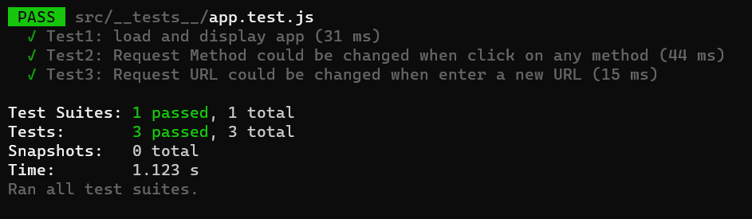
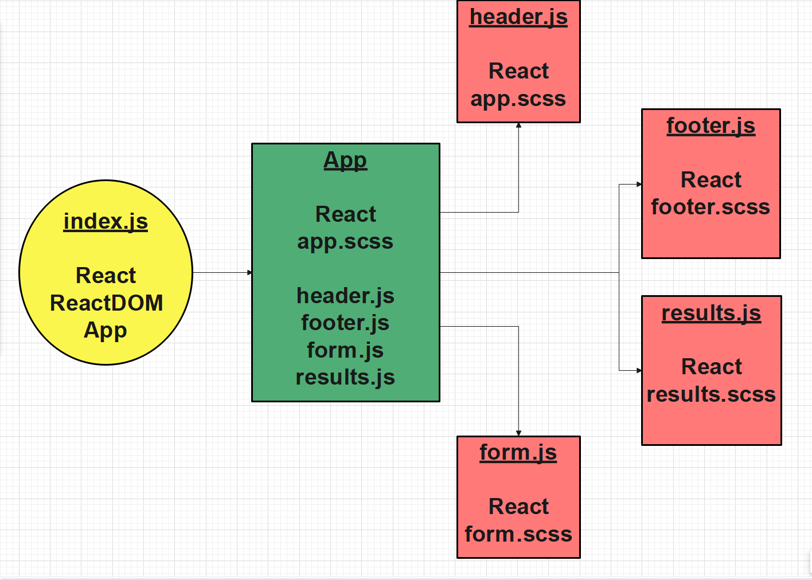

# resty
***RESTy API testing application***

## RESTy Phase 1: Begin work on the RESTy API testing application

Today, we begin the first of a 4-Phase build of the RESTy application, written in React. In this first phase, our goal is to setup the basic scaffolding of the application, with intent being to add more functionality to the system as we go. This initial build sets up the file structure so that we can progressively build this application in a scalable manner

## RESTy Phase 2: Retrieving User Input and Managing State

In phase 2, we will be receiving user input in preparation of connecting to live APIs, using the useState() hook in our functional components. In order to properly manage state with the useState hook, we will now convert App.js to a functional component.

## RESTy Phase 3: Connect RESTy with APIs, running live requests

In phase 3, we will be connecting RESTy to live APIs, fetching and displaying remote data. Our primary focus will be to service GET requests

## Tests

## UML
